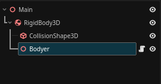

# What Things Rang?
Rang is Tool For Create Bones in Godot 4

## Requirements 
- Godot 4.3 or newer

# Because Use this Tool?
Rang Use For Bones 3D and More powerful Your Project
<<<<<<< HEAD
# Example Scene Struct

> [!TIP] 
> Remember Use Bodyer Internal RigidBody Not Eclusive, as in the demonstration

> [!WARNING]
> Use Godot 4.3 or newer

# If My Project Use 4.2 Is Compatible? 
Yes Rang Is Compatible for all version, But If Not Working Correctly Send Your pull Request and Review.
=======

>>>>>>> d3b074fff94ac2761d6b80ee91fb199e4b48b2b7
